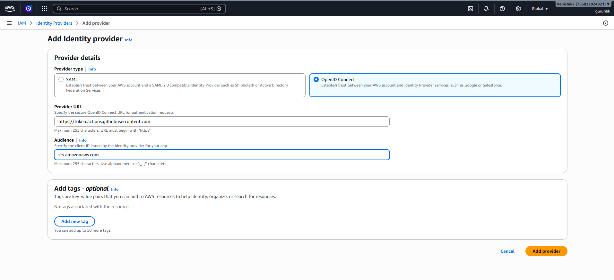
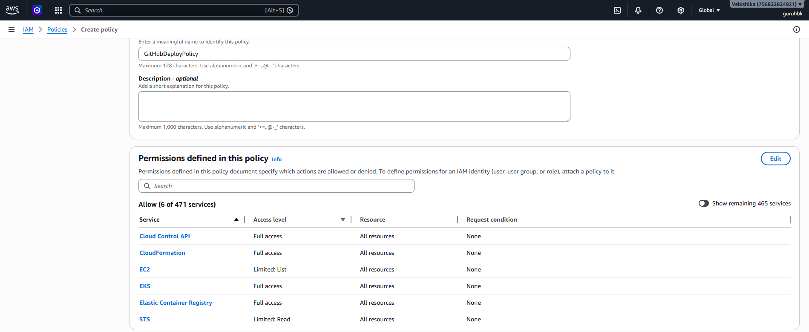
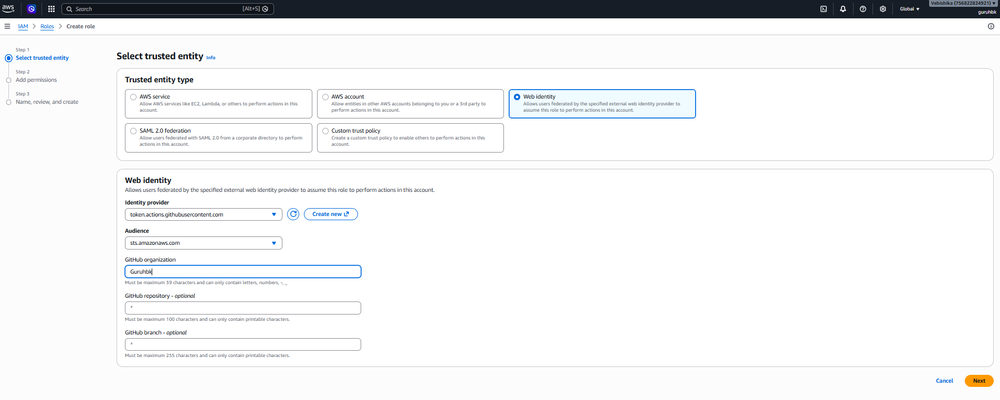

> Learn how GitHub Actions authenticates with AWS using OIDC instead of access keys. This step-by-step guide shows how to configure IAM, create an OIDC provider, and securely deploy a Node.js Lambda application.

## Introduction

For almost every application deployed on AWS, we use a CI/CD platform such as GitHub Actions to automatically build, test, and deploy our applications.

But one important question often gets overlooked:

> **How does GitHub Actions authenticate with AWS?**

The traditional approach is straightforward:

1. Create an AWS Access Key and Secret Access Key.
2. Store them as GitHub Secrets.
3. Use those credentials inside the GitHub Actions workflow.

Although this works, it comes with several security concerns:

- Long-lived credentials
- Secret rotation overhead
- Risk of accidental exposure
- Credentials may still be valid even if leaked

Fortunately, AWS and GitHub provide a much more secure solution:

**OpenID Connect (OIDC).**

In this blog, we'll learn how to connect GitHub Actions to AWS using OIDC so that **no AWS access keys are stored in GitHub**.

---

# What is OIDC?

OpenID Connect (OIDC) is an authentication protocol built on top of OAuth 2.0.

It allows applications to verify a user's or workload's identity using an external Identity Provider (IdP). Instead of relying on long-lived credentials, the application receives a signed JSON Web Token (JWT) that can be trusted by another service.

In our case:

- **GitHub** acts as the Identity Provider.
- **AWS IAM** trusts GitHub as an identity provider.
- **AWS Security Token Service (STS)** exchanges GitHub's OIDC token for temporary AWS credentials.

These temporary credentials exist only for a short duration, making them significantly more secure than permanent access keys.

---

# Why Use OIDC?

Using OIDC offers several advantages:

- ✅ No AWS Access Keys stored in GitHub
- ✅ Temporary credentials issued only when the workflow runs
- ✅ Reduced risk of credential leaks
- ✅ Automatic credential rotation
- ✅ Fine-grained IAM permissions
- ✅ Recommended by AWS and GitHub

---

# OIDC vs OAuth 2.0

Many people confuse OAuth and OIDC.

- **OAuth 2.0** is an authorization framework. It determines **what an application is allowed to access**.
- **OIDC** adds an authentication layer on top of OAuth, allowing applications to verify **who is making the request**.

GitHub uses OIDC to prove the identity of your workflow to AWS.

---

# Architecture

The authentication flow looks like this:

```text
GitHub Actions
      │
      │ Request OIDC Token
      ▼
GitHub OIDC Provider
      │
      │ JWT Token
      ▼
AWS IAM Identity Provider
      │
      │ Assume Role With Web Identity
      ▼
AWS STS
      │
      │ Temporary Credentials
      ▼
Deploy Resources (Lambda, S3, CloudFormation...)
```

No access keys are created or stored anywhere.

---

# Step 1: Create an OIDC Identity Provider


Navigate to:

```
AWS Console
→ IAM
→ Identity Providers
→ Add Provider
```

Select:

- **Provider Type:** OpenID Connect
- **Provider URL:**

```
https://token.actions.githubusercontent.com
```

- **Audience:**

```
sts.amazonaws.com
```

Click **Add Provider**.

AWS now trusts GitHub as an external identity provider.

---

# Step 2: Create an IAM Policy



Create a policy with the permissions required for deployment.

For this demo, we'll use the following policy:

```json
{
  "Version": "2012-10-17",
  "Statement": [
    {
      "Sid": "VisualEditor0",
      "Effect": "Allow",
      "Action": [
        "cloudformation:*",
        "sts:GetCallerIdentity",
        "s3:*",
        "iam:GetRole",
        "lambda:*"
      ],
      "Resource": "*"
    }
  ]
}
```

> **Note**
>
> This policy intentionally contains wildcard permissions to keep the demonstration simple.
>
> In production, always follow the **Principle of Least Privilege** by granting only the permissions required for your deployment.

---

# Step 3: Create an IAM Role


Navigate to:

```
IAM
→ Roles
→ Create Role
```

Configure the role as follows:

- **Trusted Entity Type:** Web Identity
- **Identity Provider:** `token.actions.githubusercontent.com`
- **Audience:** `sts.amazonaws.com`
- **GitHub Organization:** *your GitHub username or organization*

Attach the policy created in the previous step and create the role.

This role is what GitHub Actions will assume during deployment.

---

# Step 4: Sample Node.js Application

For this demonstration, we'll deploy a simple Node.js Lambda function using the Serverless Framework.

Repository:

**https://github.com/Guruhbk/hello-world-lambda**

The project uses the Serverless Framework to automatically create and manage:

- Lambda Function
- CloudFormation Stack
- Deployment S3 Bucket

---

# Step 5: Configure GitHub Actions

The workflow uses the official AWS GitHub Action to assume the IAM role through OIDC.

```yaml
- uses: aws-actions/configure-aws-credentials@v4
  with:
    role-to-assume: arn:aws:iam::<ACCOUNT_ID>:role/GitHubDeployRole
    aws-region: us-east-1

- name: Verify AWS Identity
  run: aws sts get-caller-identity
```

Notice that **no access keys or secrets are used**.

The action automatically:

1. Requests an OIDC token from GitHub
2. Sends it to AWS STS
3. Receives temporary credentials
4. Uses those credentials for deployment

---

# Complete GitHub Workflow

```yaml
name: deploy

on:
  push:
    branches:
      - main

permissions:
  id-token: write
  contents: read

jobs:
  deploy:
    runs-on: ubuntu-latest

    steps:
      - uses: actions/checkout@v4

      - uses: actions/setup-node@v4
        with:
          node-version: 22

      - run: npm install

      - uses: aws-actions/configure-aws-credentials@v4
        with:
          role-to-assume: arn:aws:iam::<ACCOUNT_ID>:role/GitHubDeployRole
          aws-region: us-east-1

      - name: Verify AWS Identity
        run: aws sts get-caller-identity

      - name: Serverless Version
        run: npx serverless --version

      - name: Deploy
        run: npm run deploy
```

One important permission is:

```yaml
permissions:
  id-token: write
```

Without this permission, GitHub cannot generate the OIDC token, and authentication with AWS will fail.

---

# Deployment

After merging your code into the `main` branch, GitHub Actions will automatically:

- Build the application
- Authenticate with AWS using OIDC
- Assume the IAM role
- Deploy the Serverless application
- Create or update the Lambda function

All of this happens **without storing any AWS credentials in GitHub**.

---

# GitHub Repository

Sample application:

**https://github.com/Guruhbk/hello-world-lambda**

Workflow file:

**https://github.com/Guruhbk/hello-world-lambda/blob/main/.github/workflows/deploy.yaml**

---

# Conclusion

Using OIDC is the modern and recommended way to connect GitHub Actions with AWS.

Instead of managing long-lived AWS access keys, GitHub obtains a short-lived identity token, which AWS validates before issuing temporary credentials.

This approach provides:

- Better security
- No credential management
- Automatic credential rotation
- Fine-grained IAM access
- Simpler and safer CI/CD pipelines

If you're still using AWS Access Keys in GitHub Secrets, it's a great time to migrate to OIDC and eliminate long-lived credentials from your deployment pipeline.