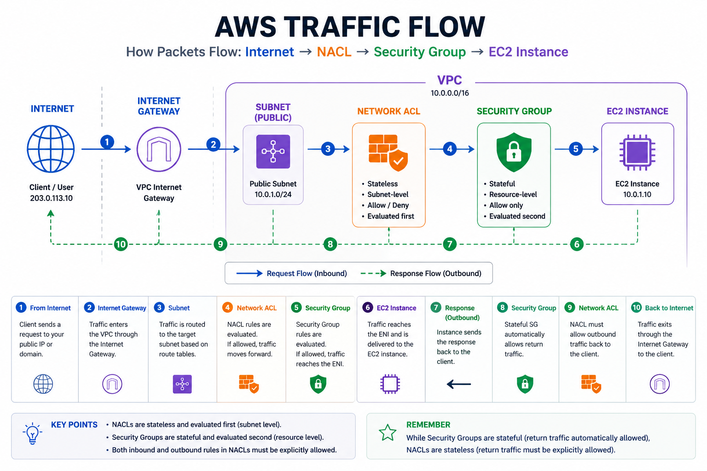
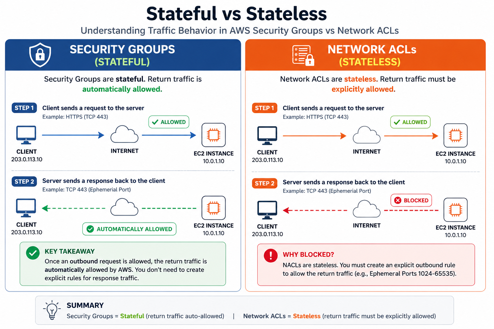
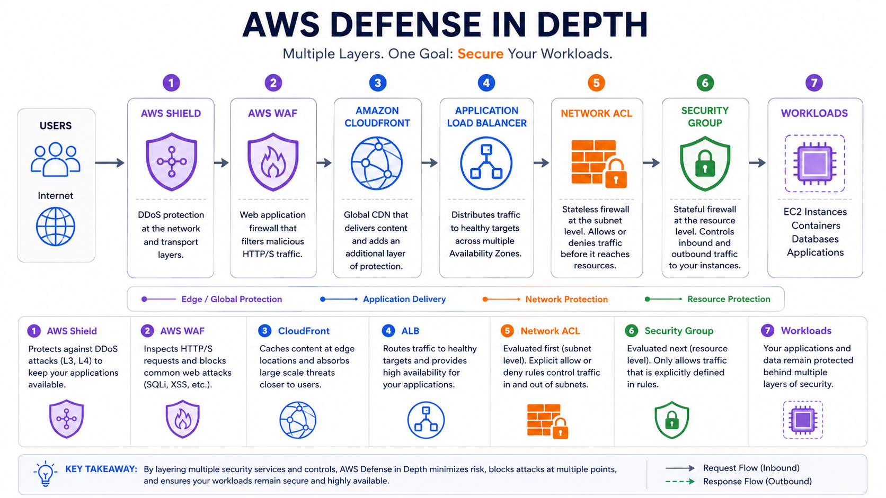

## Introduction

One of the most common misconceptions among engineers new to AWS networking is assuming that Security Groups and Network ACLs (NACLs) serve the same purpose.

At first glance, both seem to do exactly the same thing—they allow or deny network traffic. However, under the hood, they operate at different layers of the AWS networking stack and solve different problems.

I've seen production outages caused by engineers modifying a NACL when they intended to update a Security Group. I've also seen organizations rely solely on Security Groups without implementing subnet-level controls, creating unnecessary security risks.

Understanding when to use Security Groups, when to use NACLs, and when to use both can significantly improve the security posture of your AWS environment.

---

# Understanding AWS Networking First




Before comparing Security Groups and NACLs, let's understand where they sit in the AWS network path.

Traffic must pass through both layers before reaching your workload.

Think of it this way:

- Network ACL = Security guard at the building entrance
- Security Group = Security guard at the apartment door

Even if someone gets into the building, they still need permission to enter your apartment.

---

# What is a Security Group?

A Security Group acts as a virtual firewall attached directly to AWS resources.

Examples:

- EC2 instances
- Load Balancers
- RDS databases
- Elastic Network Interfaces (ENIs)

A Security Group controls which traffic can enter or leave a specific resource.

## Key Characteristic: Security Groups are Stateful

When inbound traffic is allowed, the return traffic is automatically allowed.

You do not need to create additional outbound rules for response traffic.

---

# What is a Network ACL (NACL)?

A Network Access Control List is a firewall operating at the subnet level.

Unlike Security Groups, NACLs are attached to subnets rather than individual resources.

Every resource inside that subnet inherits the NACL rules.




## Key Characteristic: NACLs are Stateless

A NACL does not remember connections.

If inbound traffic is allowed, the return traffic must also be explicitly allowed.

This is one of the most common causes of connectivity issues.

---

# Security Group vs NACL: Side-by-Side Comparison

| Feature | Security Group | NACL |
|-----------|----------------|------|
| Applied To | Instance/ENI | Subnet |
| Stateful | Yes | No |
| Supports Allow Rules | Yes | Yes |
| Supports Deny Rules | No | Yes |
| Rule Evaluation | All rules evaluated | Rules processed in order |
| Default Behavior | Deny all inbound | Allow all inbound/outbound |
| Granularity | Resource level | Subnet level |
| Typical Use | Workload protection | Network segmentation |

---

# Real-World Use Case #1: Public Web Application

Architecture:

```text
Internet
   |
ALB
   |
Web Servers
```

Security Groups are used to restrict access to only the required ports.

NACLs remain simple and provide subnet-level protection.

---

# Real-World Use Case #2: Blocking a Malicious IP

Suppose an attacker continuously sends traffic from:

```text
198.51.100.25
```

Security Groups cannot explicitly deny traffic.

A NACL can immediately block the IP:

```text
Rule 50
DENY 198.51.100.25/32
```

This is one of the strongest use cases for NACLs.

---

# Real-World Use Case #3: Three-Tier Application

```text
Internet
   |
Load Balancer
   |
Application Servers
   |
Database Servers
```

Security Groups enforce service-to-service communication.

NACLs provide subnet isolation and defense in depth.

---

# Common Mistakes Engineers Make

## Forgetting Ephemeral Ports

Engineers often allow inbound HTTPS traffic but forget outbound ephemeral ports in NACLs.

Result:

- Requests reach the server
- Responses get blocked
- Application appears broken

## Using NACLs for Everything

This creates unnecessary complexity and operational overhead.

Security Groups should remain the primary security control.

## Opening Entire VPC Ranges

Avoid broad CIDRs such as:

```text
10.0.0.0/8
```

Always follow least privilege principles.

---

# How Experienced Cloud Architects Use Them Together

### Security Groups

Used for:

- Application-level security
- Database access control
- Service-to-service communication
- Load Balancer restrictions

### NACLs

Used for:

- Network segmentation
- Explicit deny rules
- Compliance requirements
- Blocking malicious IP ranges

---

# Defense in Depth




If one layer fails, another layer continues protecting the workload.

---

# Final Thoughts

Security Groups and Network ACLs are not competing technologies.

Security Groups provide fine-grained protection at the resource level, while NACLs provide subnet-level filtering and explicit deny capabilities.

The strongest AWS environments use both together as part of a layered security strategy.

The question should never be:

> Should I use Security Groups or NACLs?

Instead ask:

> How can I use Security Groups and NACLs together to reduce risk?
